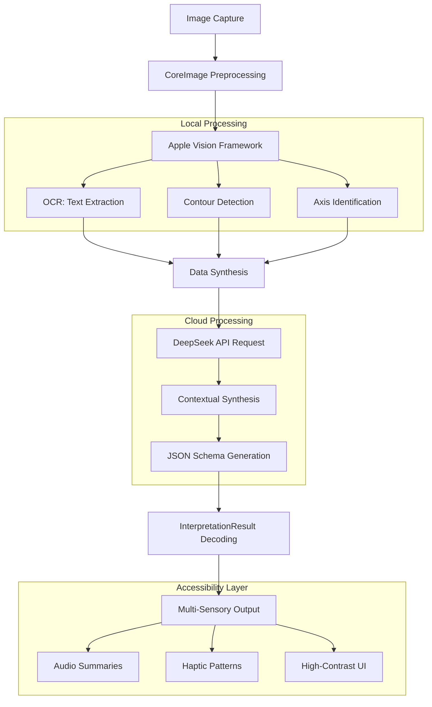

# TSA Nationals 2026 Submission (Team 2284-1): Statsense

## What is Statsense? 

StatSense is an iOS app designed to bridge the gap between visual data and non-visual interpretation. By combining Apple's Vision Framework with the DeepSeek API, StatSense translates static graphs, charts, and diagrams into multi-sensory experiences through audio descriptions, haptic feedback, and high-contrast visual modes.


## Why It Matters

Education in many fields often relies heavily on visual data. For blind, low-vision, or color-blind students, interpreting a simple line graph without assistance can be a significant challenge.

StatSense addresses this problem by:
- **Removing Barriers**: Providing access to visual information without requiring a human assistant.
- **Sensory Learning**: Utilizing a custom haptic feedback system to allow the user to navigate the app.
- **Tools for Education**: Enabling students to participate in data driven subjects with the same independence as their sighted peers.


## Key Features

### Audio Interpretation
- **Summaries of Images**: Generates clear descriptions of graph trends, axes, and key data points.
- **Screen Reader**: Fully compatible with voice over for accessible navigation.
- **Adjustable Speech**: Customizable audio settings to match individual user preferences.
- **Worldwide Compatability**: Natural speech AI supporting 7 worldwide languages from English to Japanese. 

### Accessible Visuals
- **Adaptive UI**: A dedicated High-Contrast mode designed for users with visual impairments.
- **Color Blind Modes**: Curated color schemes optimized for Protanopia, Deuteranopia, and Tritanopia.
- **Global Font Scaling**: A simplified font-size slider that maps to the system's Dynamic Type for app-wide legibility.


## Technical Architecture

StatSense uses a two-stage pipeline to analyze images locally and through the cloud:



### 1. Local Vision Processing
- **Image Preprocessing**: Utilizes CoreImage filters to remove background noise.
- **Text Recognition**: VNRecognizeTextRequest captures axis labels, titles, and data points directly on the device.

### 2. API Interpretation
- **Prompting**: Local vision data is fed into the DeepSeek model using structured prompts.
- **Data**: The API returns a strict JSON schema the app is then able to decode. 
- **Translation**: Abstract data points are mapped to readable descriptions and instructions.


## Installation & Setup

StatSense uses XcodeGen for project management to maintain a clean repository.

### Prerequisites
- macOS Sonoma or later
- Xcode 15.0+
- iOS 17.0+ (Target Device)
- XcodeGen installed (`brew install xcodegen`)

### Getting Started

1. **Clone the repository**:
   ```bash
   git clone https://github.com/username/StatSense.git
   cd StatSense
   ```

2. **Generate the Xcode Project**:
   ```bash
   xcodegen generate
   ```

3. **Configure API Keys**:
   - Open `Config.xcconfig`.
   - Add your DeepSeek API Key:
     `DEEPSEEK_API_KEY = "sk-your-key-here"`
   - Add your Deepgram API Key:
     `DeepgramTTSAPIKey = "your-key-here"`

4. **Run**:
   - Open `StatSense.xcodeproj` in Xcode.
   - Select your Development Team in Signing & Capabilities.
   - Build and run on a physical device to test the haptic features.
   - Building and running on Simulator is compatable as well. 


